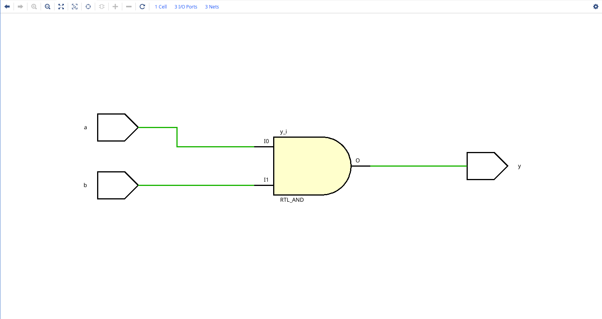
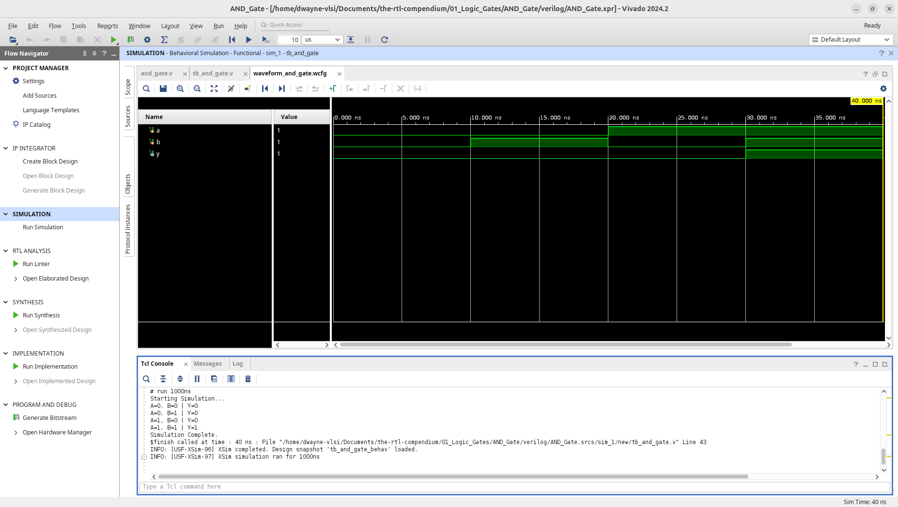
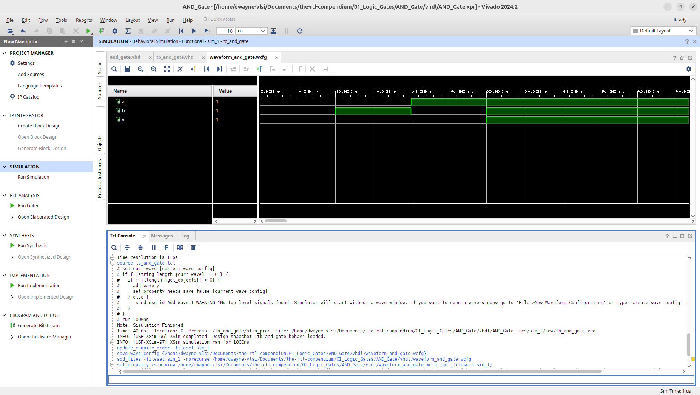
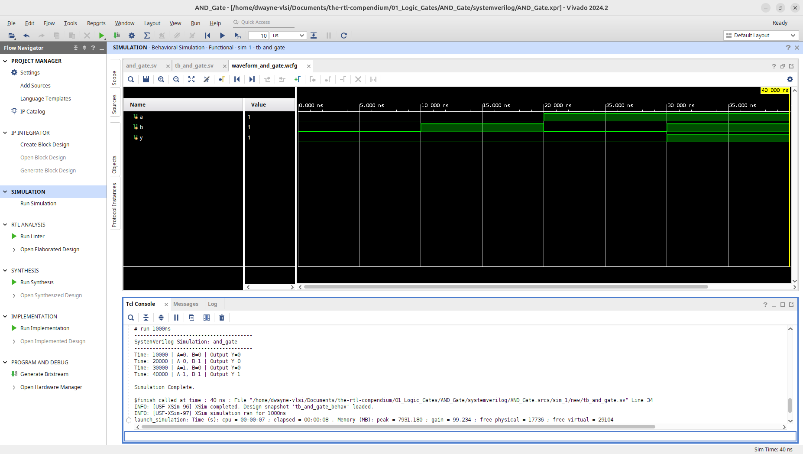

# AND Gate Logic Primitive

This module implements a basic 2-input AND gate across multiple HDLs. The design has been verified through RTL elaboration and behavioral simulation using **AMD Vivado 2024.2**.

## 1. Hardware Schematic (RTL Analysis)
The following schematic was generated using the **Vivado Elaborated Design** tool. It represents the logical mapping of the Verilog code into generic hardware primitives.

## 2. Logic Specification
The AND gate follows the standard Boolean operation where the output is high only if all inputs are high.

**Boolean Equation:** $$Y = A \cdot B$$

### Truth Table
| Input A | Input B | Output Y |
|---------|---------|----------|
|    0    |    0    |    0     |
|    0    |    1    |    0     |
|    1    |    0    |    0     |
|    1    |    1    |    1     |

---

## 3. Implementation
This repository provides the implementation in three major Hardware Description Languages (HDLs).

* **[Verilog Source](verilog/and_gate.v)**
* **[VHDL Source](vhdl/and_gate.vhd)**
* **[SystemVerilog Source](systemverilog/and_gate.sv)**

---

## 4. Verification & Simulation
To ensure logic correctness, a testbenches were used to sweep through all input combinations ($2^2 = 4$).
* **[Verilog Testbench](verilog/tb_and_gate.v)**
* **[VHDL Testbench](vhdl/tb_and_gate.vhd)**
* **[SystemVerilog Testbench](systemverilog/tb_and_gate.sv)**

### Behavioral Waveform & Tcl Console Output
The simulation below confirms that the output `y` transitions to high only when both `a` and `b` are asserted.

**Verilog Waveform:**

**VHDL Waveform:**

**SystemVerilog Waveform:**

