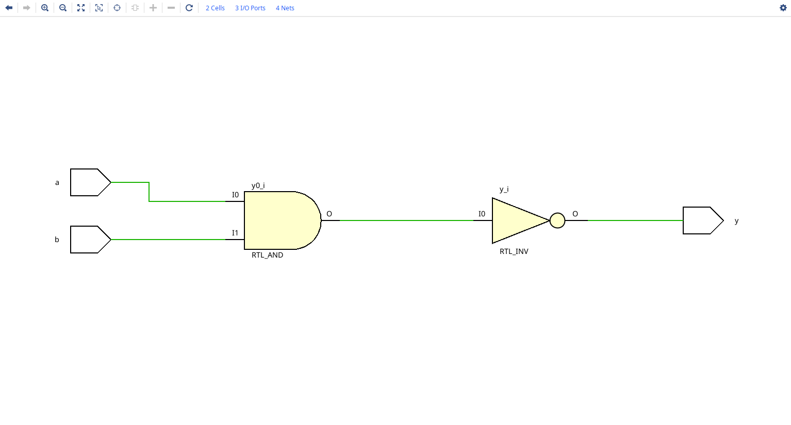
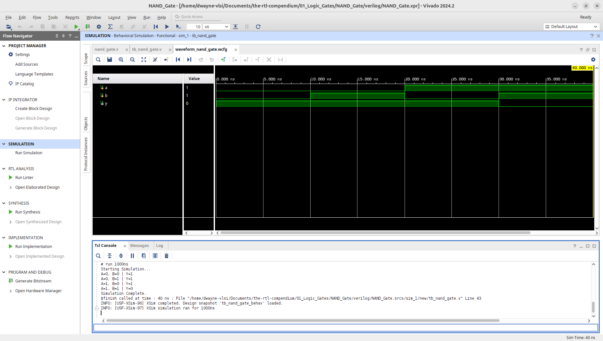
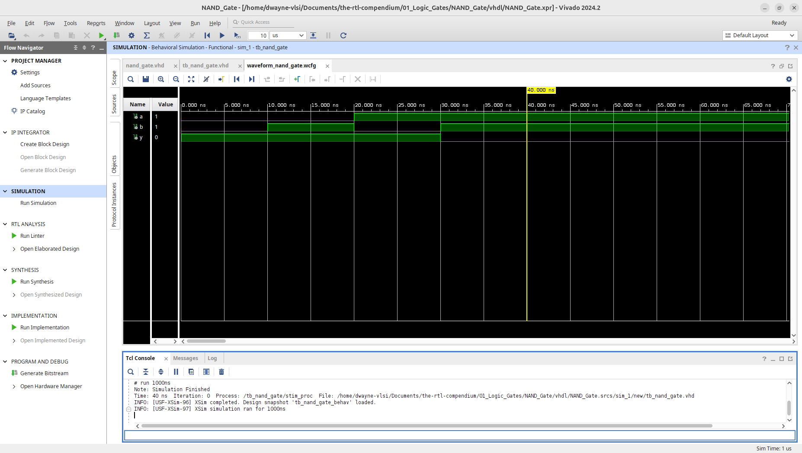
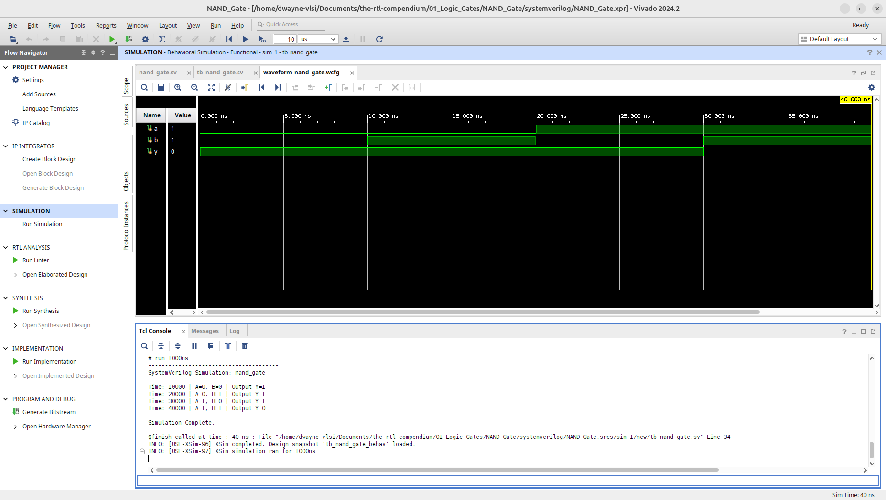

# NAND Gate Logic Primitive
 
This module implements a 2-input NAND (Not-AND) gate, a "Universal Gate" in digital logic across multiple HDLs. The design has been verified through RTL elaboration and behavioral simulation using **AMD Vivado 2024.2**.

## 1. Hardware Schematic (RTL Analysis)
The following schematic was generated using the **Vivado Elaborated Design** tool. It represents the logical mapping of the HDL code into generic hardware primitives.

**Note on Decomposition:** As seen in the diagram, Vivado elaborates the NAND logic by connecting an `RTL_AND` primitive to an `RTL_INV` (Inverter). While these appear as two separate components in the elaborated view, they are optimized into a single Physical LUT during the synthesis phase.

## 2. Logic Specification
The NAND gate outputs a Low (0) only when all its inputs are High (1). For all other input combinations, the output remains High (1).

**Boolean Equation:** $$Y = \overline{A \cdot B}$$

### Truth Table
| Input A | Input B | Output Y |
| :---: | :---: | :---: |
| 0 | 0 | 1 |
| 0 | 1 | 1 |
| 1 | 0 | 1 |
| 1 | 1 | 0 |

---

## 3. Implementation
This repository provides the implementation in three major Hardware Description Languages (HDLs).

* **[Verilog Source](verilog/nand_gate.v)**
* **[VHDL Source](vhdl/nand_gate.vhd)**
* **[SystemVerilog Source](systemverilog/nand_gate.sv)**

---

## 4. Verification & Simulation
To ensure logic correctness, testbenches were used to sweep through all input combinations ($2^2 = 4$).
* **[Verilog Testbench](verilog/tb_nand_gate.v)**
* **[VHDL Testbench](vhdl/tb_nand_gate.vhd)**
* **[SystemVerilog Testbench](systemverilog/tb_nand_gate.sv)**

### Behavioral Waveform & Tcl Console Output
The simulation waveforms confirm that the output `y` drops to 0 only at the 40ns mark when both `a` and `b` are asserted.

**Verilog Waveform:**

**VHDL Waveform:**

**SystemVerilog Waveform:**

