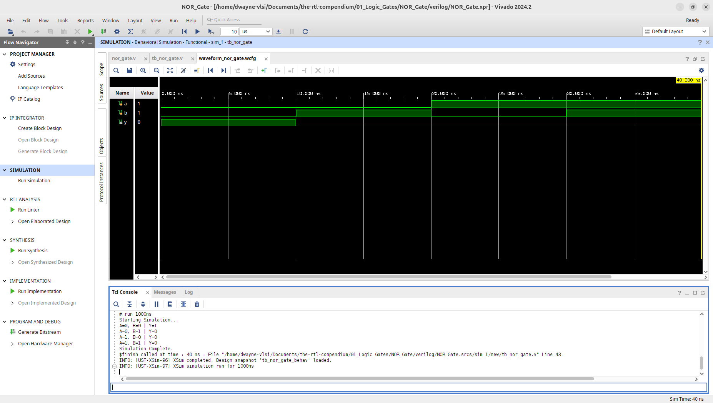
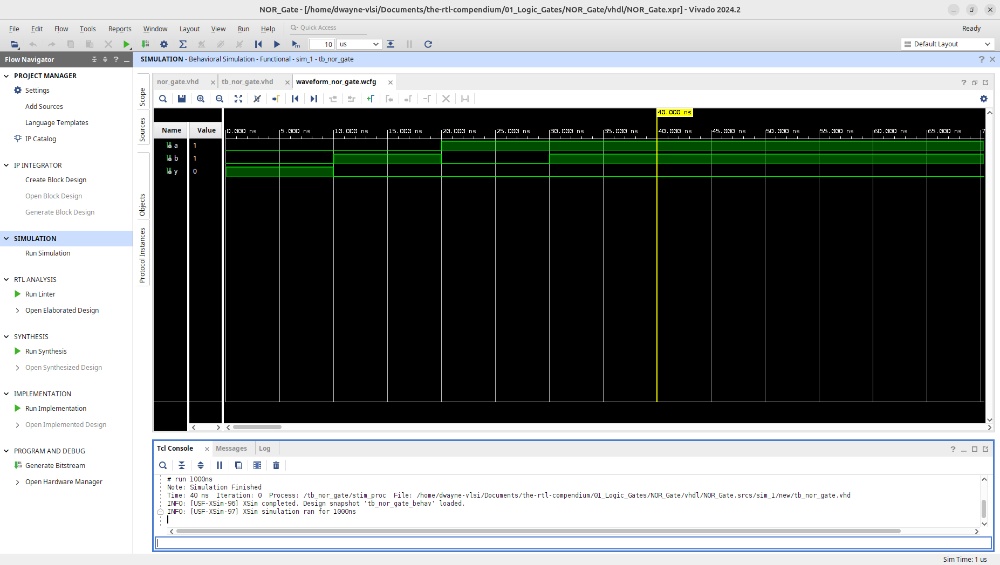
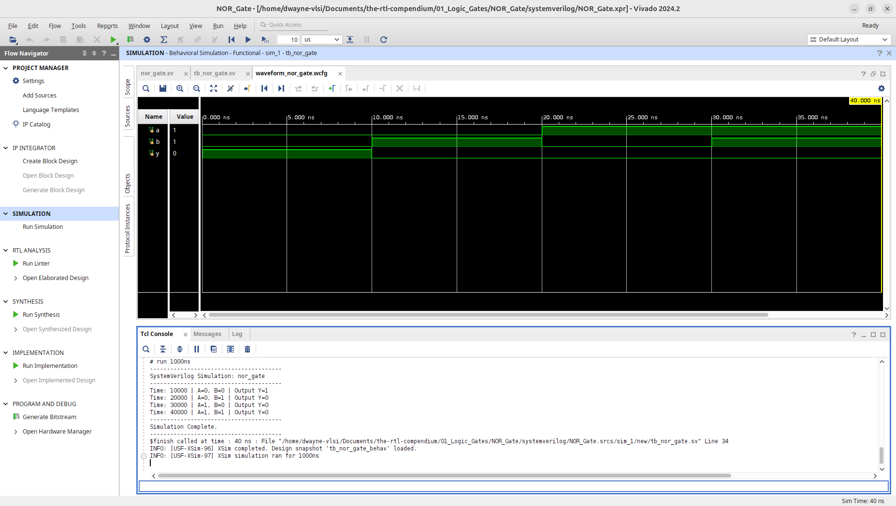

# NOR Gate Logic Primitive

This module implements a 2-input NOR (Not-OR) gate, which is functionally universal in digital logic design across multiple HDLs. The design has been verified through RTL elaboration and behavioral simulation using **AMD Vivado 2024.2**.

## 1. Hardware Schematic (RTL Analysis)
The following schematic was generated using the **Vivado Elaborated Design** tool. It represents the logical mapping of the HDL code into generic hardware primitives.

**Note on Decomposition:** Similar to the NAND implementation, Vivado elaborates the NOR logic by mapping it to an `RTL_OR` primitive followed by an `RTL_INV` (Inverter). This "Generic" view illustrates how the compiler interprets the Boolean expression before physical optimization into a single Look-Up Table (LUT).

## 2. Logic Specification
The NOR gate outputs a High (1) only when both inputs are Low (0). If any input is High, the output is forced Low (0).

**Boolean Equation:** $$Y = \overline{A + B}$$

### Truth Table
| Input A | Input B | Output Y |
| :---: | :---: | :---: |
| 0 | 0 | 1 |
| 0 | 1 | 0 |
| 1 | 0 | 0 |
| 1 | 1 | 0 |

---

## 3. Implementation
This repository provides the implementation in three major Hardware Description Languages (HDLs).

* **[Verilog Source](verilog/nor_gate.v)**
* **[VHDL Source](vhdl/nor_gate.vhd)**
* **[SystemVerilog Source](systemverilog/nor_gate.sv)**

---

## 4. Verification & Simulation
To ensure logic correctness, testbenches were used to sweep through all input combinations ($2^2 = 4$).
* **[Verilog Testbench](verilog/tb_nor_gate.v)**
* **[VHDL Testbench](vhdl/tb_nor_gate.vhd)**
* **[SystemVerilog Testbench](systemverilog/tb_nor_gate.sv)**

### Behavioral Waveform & Tcl Console Output
The simulation waveform confirms the logic: the output `y` is High only during the initial state ($A=0, B=0$) and drops as soon as either input toggles.

**Verilog Waveform:**

**VHDL Waveform:**

**SystemVerilog Waveform:**

