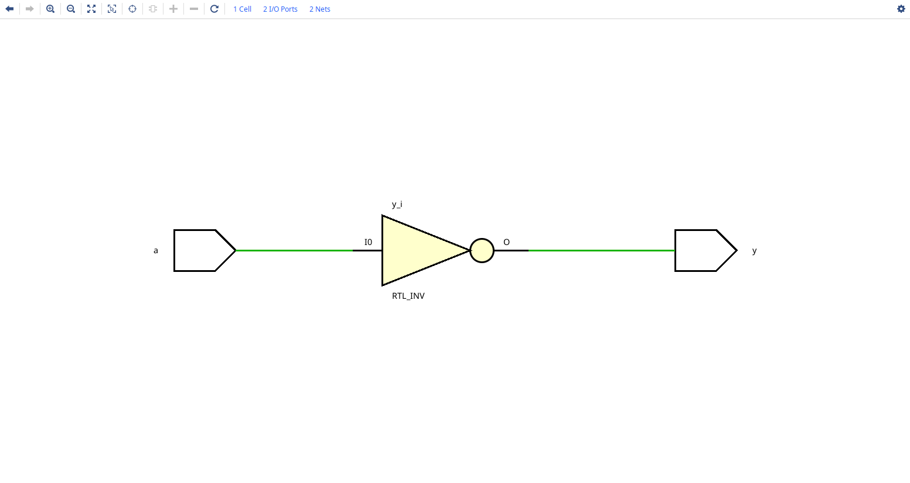
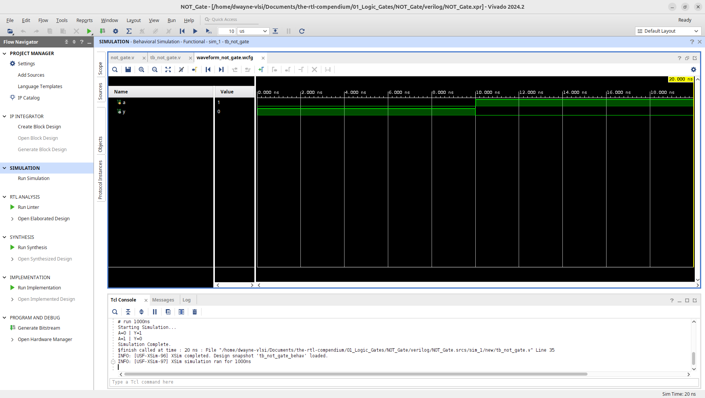
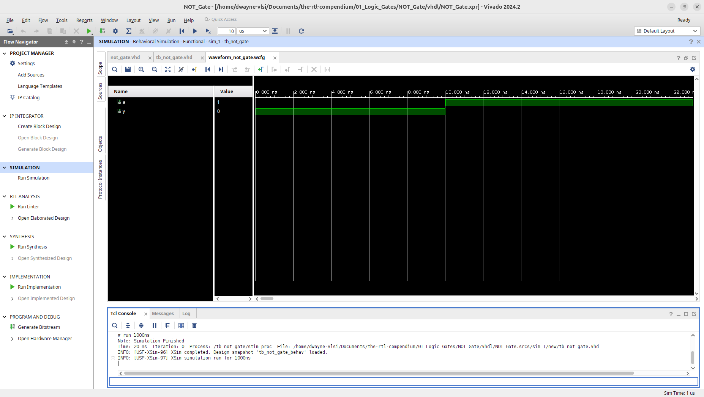
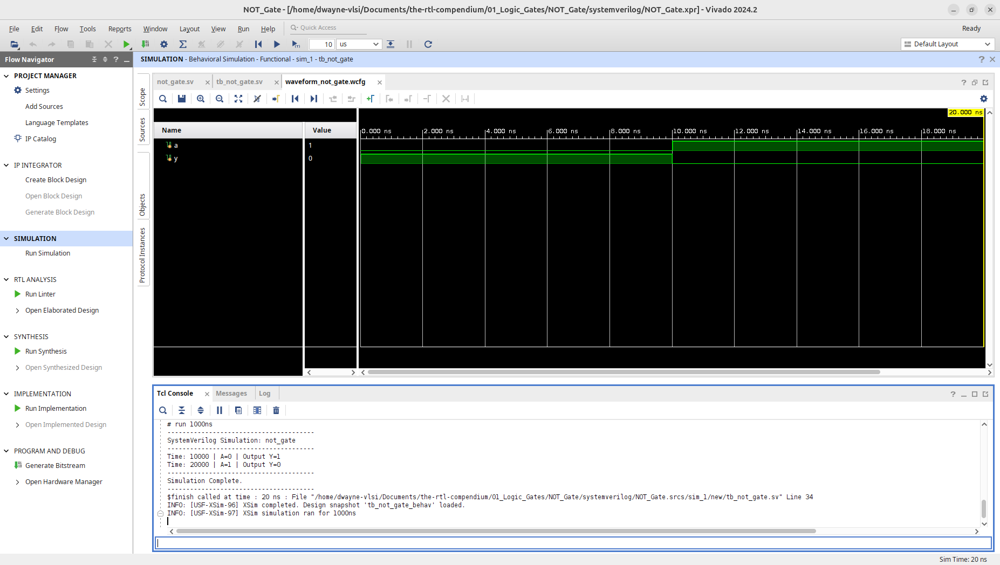

# NOT Gate Logic Primitive (Inverter)

This module implements a basic 1-input NOT gate, also known as an inverter across multiple HDLs. This is the simplest logic primitive in the **RTL Compendium**, used to flip the state of a digital signal. The design has been verified through RTL elaboration and behavioral simulation using **AMD Vivado 2024.2**.

## 1. Hardware Schematic (RTL Analysis)
The following schematic was generated using the **Vivado Elaborated Design** tool. Unlike the AND/OR gates, the NOT gate (Inverter) is represented by a triangle with a "bubble" at the output, indicating logical negation.

## 2. Logic Specification
The NOT gate outputs the logical complement of its input. If the input is High (1), the output is Low (0), and vice versa.

**Boolean Equation:** $$Y = \overline{A}$$

### Truth Table
| Input A | Output Y |
| :---: | :---: |
| 0 | 1 |
| 1 | 0 |

---

## 3. Implementation
This repository provides the implementation in three major Hardware Description Languages (HDLs).

* **[Verilog Source](verilog/not_gate.v)**
* **[VHDL Source](vhdl/not_gate.vhd)**
* **[SystemVerilog Source](systemverilog/not_gate.sv)**

---

## 4. Verification & Simulation
Verification was performed by toggling the single input `a` across both possible logical states.
* **[Verilog Testbench](verilog/tb_not_gate.v)**
* **[VHDL Testbench](vhdl/tb_not_gate.vhd)**
* **[SystemVerilog Testbench](systemverilog/tb_not_gate.sv)**
  
### Behavioral Waveform & Tcl Console Output
The simulation waveform confirms that the output `y` is always the inverse of the input signal `a`.

**Verilog Waveform:**

**VHDL Waveform:**

**SystemVerilog Waveform:**

