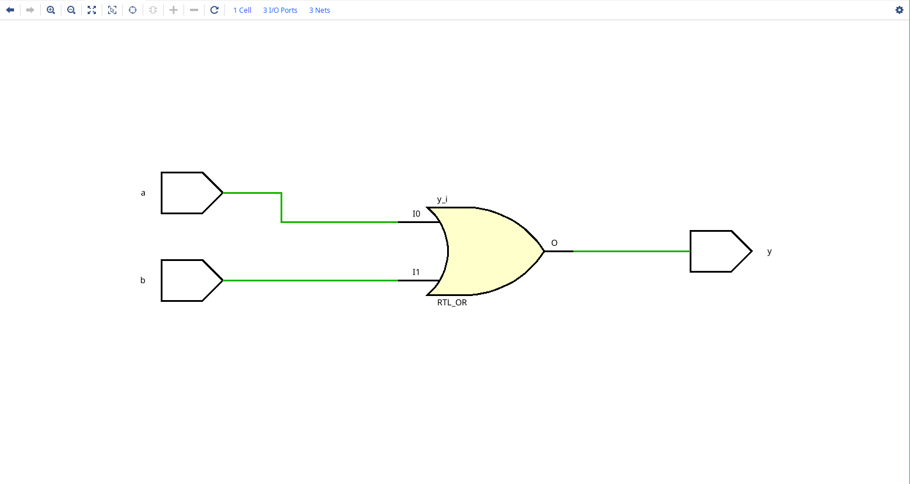
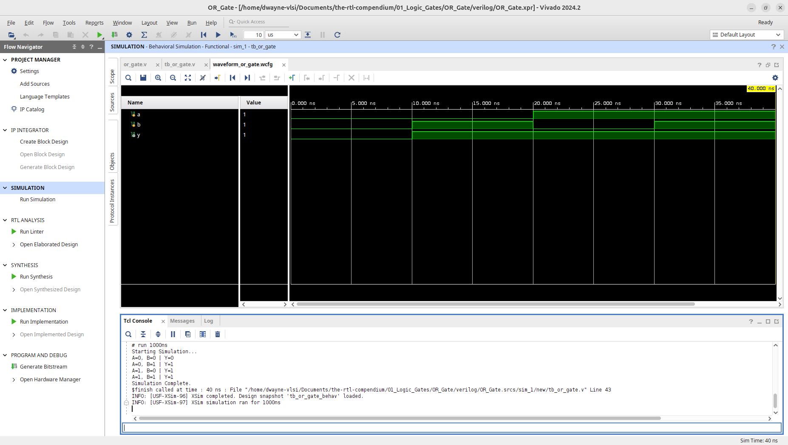
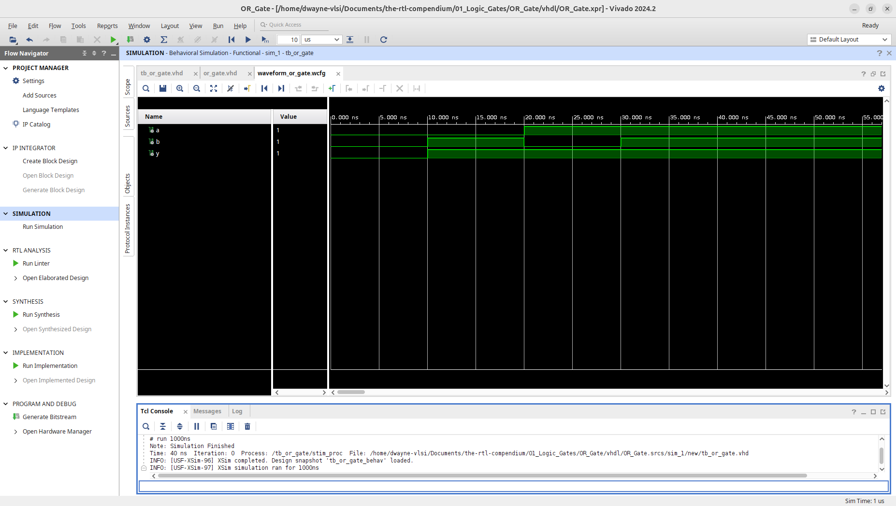
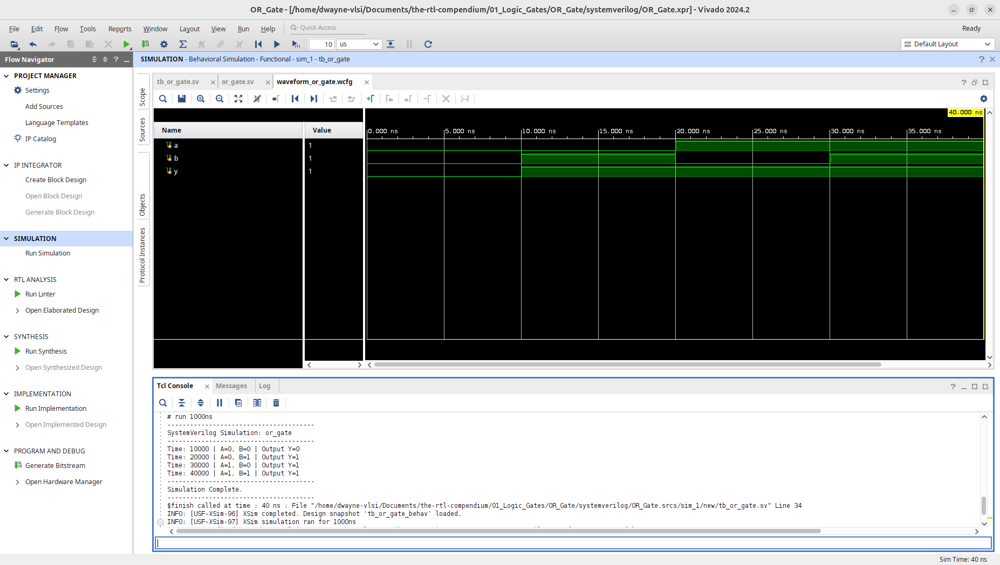

# OR Gate Logic Primitive

This module implements a basic 2-input OR gate across multiple HDLs. The design has been verified through RTL elaboration and behavioral simulation using **AMD Vivado 2024.2**.

## 1. Hardware Schematic (RTL Analysis)
The following schematic was generated using the **Vivado Elaborated Design** tool. It represents the logical mapping of the HDL code into generic hardware primitives.

## 2. Logic Specification
The OR gate follows the standard Boolean operation where the output is high if at least one input is high.

**Boolean Equation:** $$Y = A + B$$

### Truth Table
| Input A | Input B | Output Y |
| :---: | :---: | :---: |
| 0 | 0 | 0 |
| 0 | 1 | 1 |
| 1 | 0 | 1 |
| 1 | 1 | 1 |

---

## 3. Implementation
This repository provides the implementation in three major Hardware Description Languages (HDLs).

* **[Verilog Source](verilog/or_gate.v)**
* **[VHDL Source](vhdl/or_gate.vhd)**
* **[SystemVerilog Source](systemverilog/or_gate.sv)**

---

## 4. Verification & Simulation
To ensure logic correctness, testbenches were used to sweep through all input combinations ($2^2 = 4$).
* **[Verilog Testbench](verilog/tb_or_gate.v)**
* **[VHDL Testbench](vhdl/tb_or_gate.vhd)**
* **[SystemVerilog Testbench](systemverilog/tb_or_gate.sv)**

### Behavioral Waveform & Tcl Console Output
The simulations below confirm that the output `y` stays high for all states except when both `a` and `b` are low.

**Verilog Waveform:**

**VHDL Waveform:**

**SystemVerilog Waveform:**

