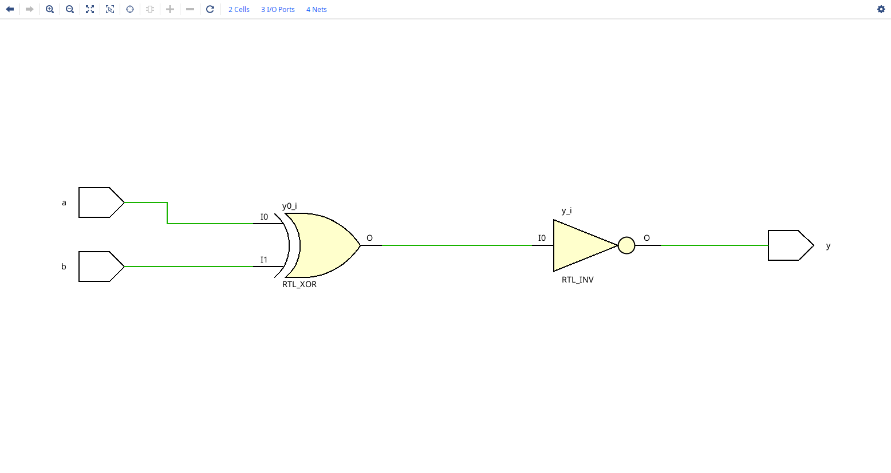
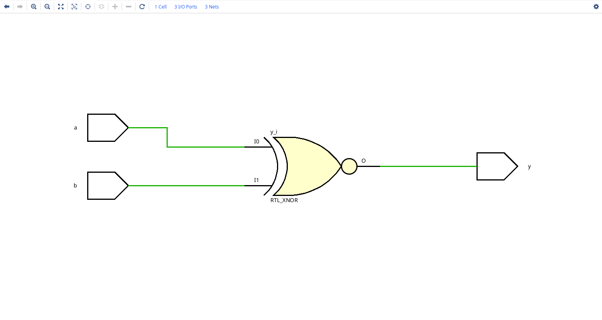
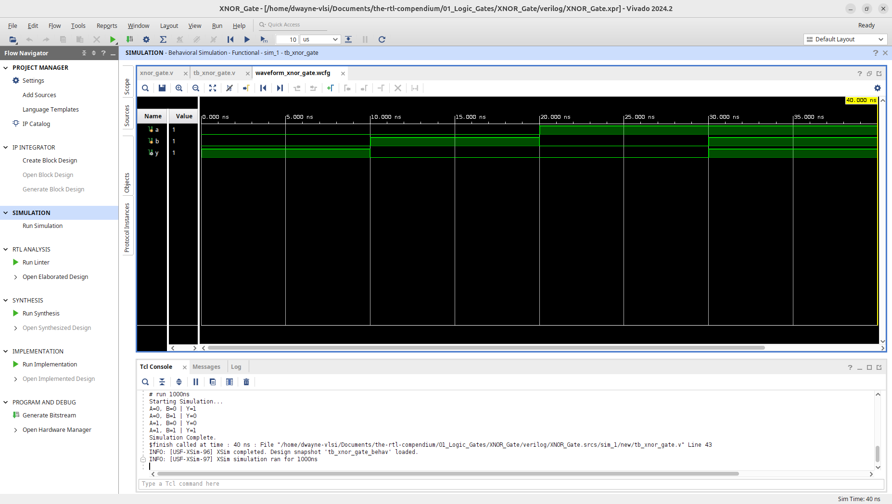
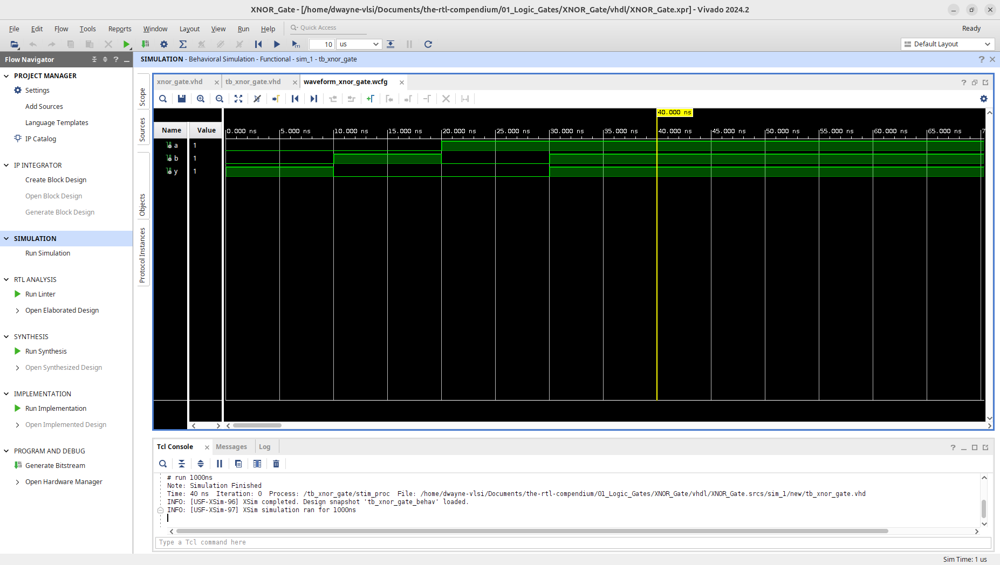
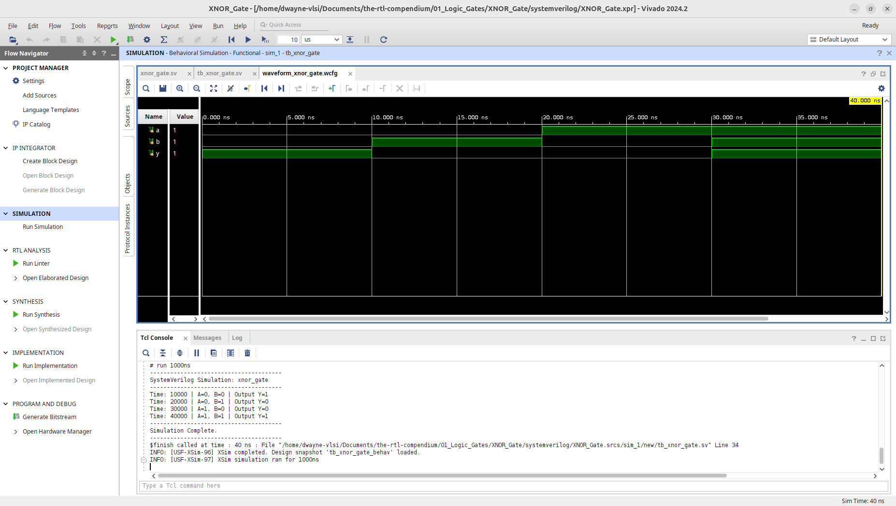

# XNOR Gate Logic Primitive

This module implements a 2-input XNOR (Exclusive-NOR) gate. Unlike a standard XOR gate, the XNOR output is High only when the inputs are logically equivalent. This design has been verified through RTL elaboration and behavioral simulation using **AMD Vivado 2024.2**.

## 1. Hardware Schematic (RTL Analysis)
The following schematics were generated using the **Vivado Elaborated Design** tool. It represents the logical mapping of the HDL code into generic hardware primitives.

A key observation in this primitive is the difference in how Hardware Description Languages are interpreted during the elaboration phase. In Verilog/SystemVerilog, the use of bitwise operators results in a decomposed view (XOR + Inverter), whereas VHDL's dedicated keyword allows for a single primitive mapping.

### Verilog/SystemVerilog Elaborated View
In the Verilog/SystemVerilog RTL view, the gate is represented as an **RTL_XOR** followed by an **RTL_INV**. This reflects the literal interpretation of the `~(a ^ b)` syntax.

### VHDL Elaborated View
In the VHDL RTL view, the gate is represented as a single **RTL_XNOR** primitive, as the tool maps the `xnor` operator directly to its internal library cell.

---

## 2. Logic Specification
The XNOR gate acts as an "Equivalence Detector." It outputs a High (1) if both inputs are the same. If the inputs differ, the output is Low (0).

**Boolean Equation:** $$Y = \overline{A \oplus B}$$
(Expanded form: $Y = AB + \overline{A}\overline{B}$)

### Truth Table
| Input A | Input B | Output Y |
| :---: | :---: | :---: |
| 0 | 0 | 1 |
| 0 | 1 | 0 |
| 1 | 0 | 0 |
| 1 | 1 | 1 |

---

## 3. Implementation
The logic is implemented in three primary HDLs to demonstrate consistency in coding style and synthesis results across the RTL compendium.

* **[Verilog Source](verilog/xnor_gate.v)**
* **[VHDL Source](vhdl/xnor_gate.vhd)**
* **[SystemVerilog Source](systemverilog/xnor_gate.sv)**

---

## 4. Verification & Simulation
Verification was performed by cycling through all four input combinations to confirm the "Equivalence" logic behavior.
* **[Verilog Testbench](verilog/tb_xnor_gate.v)**
* **[VHDL Testbench](vhdl/tb_xnor_gate.vhd)**
* **[SystemVerilog Testbench](systemverilog/tb_xnor_gate.sv)**

### Behavioral Waveform & Tcl Console Output
The simulation waveform confirms that the output $Y$ is High when $A$ and $B$ match, and transitions to Low as soon as an inequality is detected.

**Verilog Waveform:**

**VHDL Waveform:**

**SystemVerilog Waveform:**

