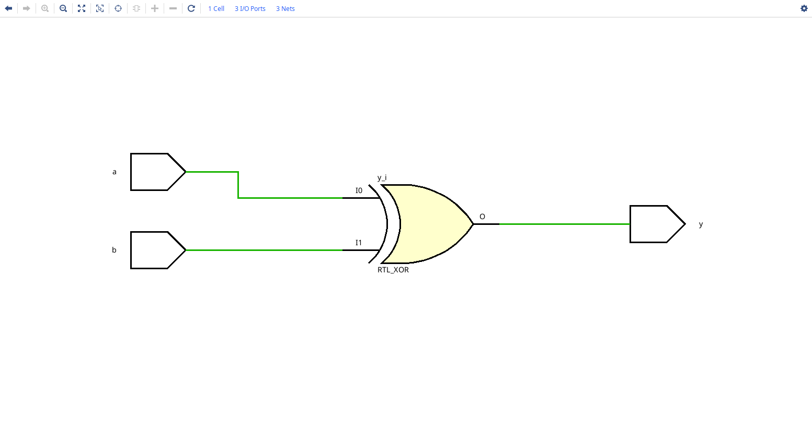
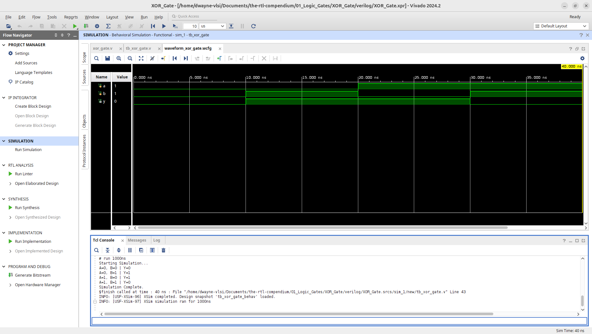
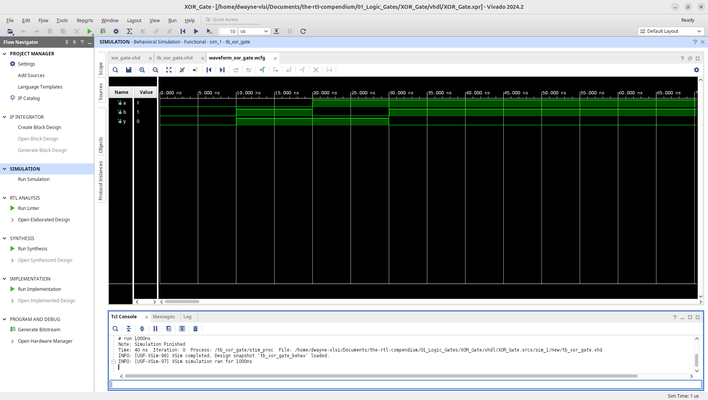
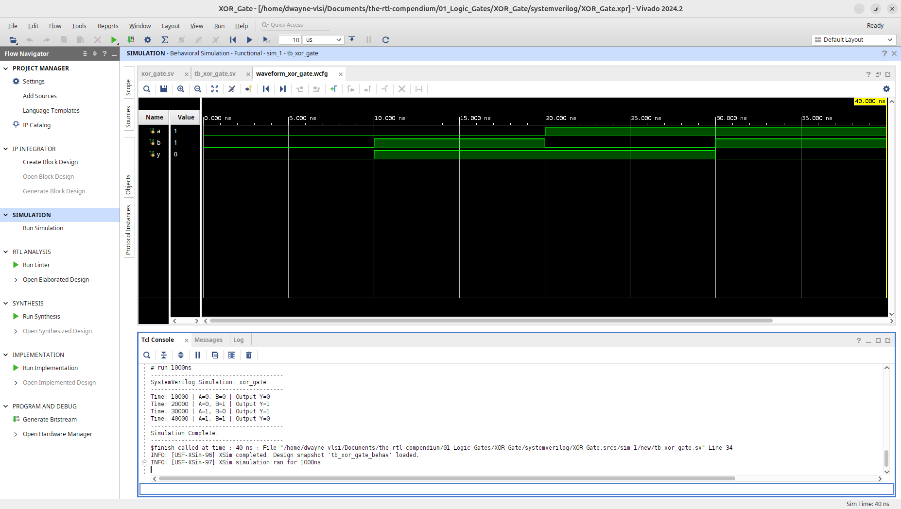

# XOR Gate Logic Primitive

This module implements a 2-input XOR (Exclusive-OR) gate across multiple HDLs. Unlike a standard OR gate, the XOR output is High only when the inputs are logically different. This design has been verified through RTL elaboration and behavioral simulation using **AMD Vivado 2024.2**.

## 1. Hardware Schematic (RTL Analysis)
The following schematic was generated using the **Vivado Elaborated Design** tool. It represents the logical mapping of the HDL code into generic hardware primitives.

In the RTL view, the XOR gate is represented by its distinct symbol—an OR gate with a secondary curved line at the input. Unlike the NAND/NOR gates, which Vivado often decomposes into two parts, the XOR is frequently treated as a single high-level primitive during elaboration.

## 2. Logic Specification
The XOR gate acts as an "Inequality Detector." It outputs a High (1) if exactly one input is High. If both are the same, the output is Low (0).

**Boolean Equation:** $$Y = A \oplus B$$
*(Expanded form: $Y = A\overline{B} + \overline{A}B$)*

### Truth Table
| Input A | Input B | Output Y |
| :---: | :---: | :---: |
| 0 | 0 | 0 |
| 0 | 1 | 1 |
| 1 | 0 | 1 |
| 1 | 1 | 0 |

---

## 3. Implementation
The logic is implemented in three primary HDLs to demonstrate consistency in coding style and synthesis results.

* **[Verilog Source](verilog/xor_gate.v)**
* **[VHDL Source](vhdl/xor_gate.vhd)**
* **[SystemVerilog Source](systemverilog/xor_gate.sv)**

---

## 4. Verification & Simulation
Verification was performed by cycling through all four input combinations to confirm the "Exclusive" logic behavior.
* **[Verilog Testbench](verilog/tb_xor_gate.v)**
* **[VHDL Testbench](vhdl/tb_xor_gate.vhd)**
* **[SystemVerilog Testbench](systemverilog/tb_xor_gate.sv)**

### Behavioral Waveform & Tcl Console Output
The simulation waveform confirms the characteristic "bit-flip" at the 40ns mark where $A=1, B=1$ causes the output $Y$ to return to 0.

**Verilog Waveform:**

**VHDL Waveform:**

**SystemVerilog Waveform:**

