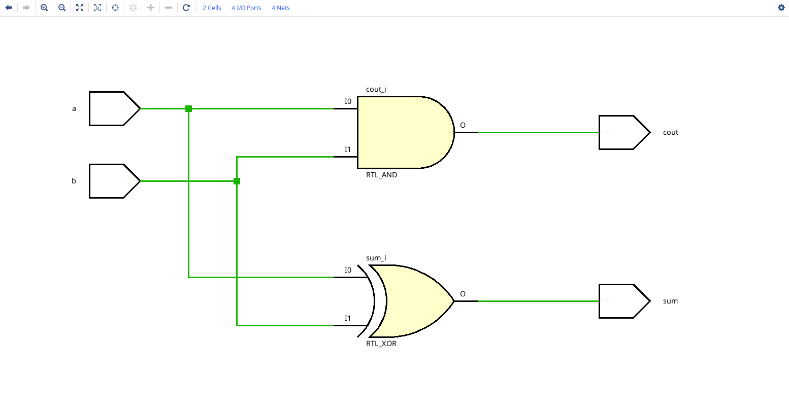
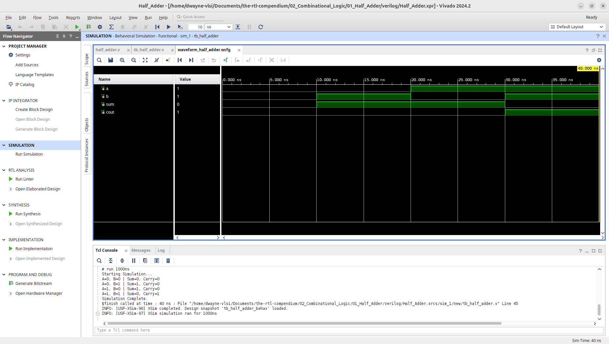
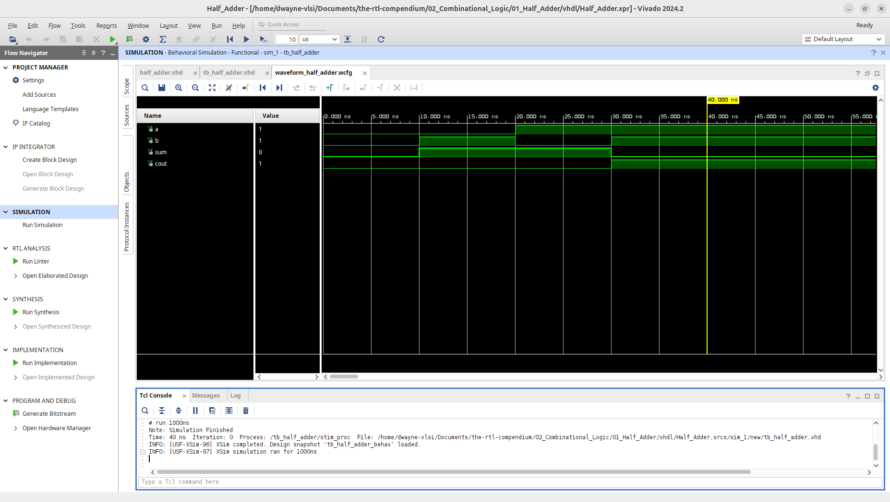
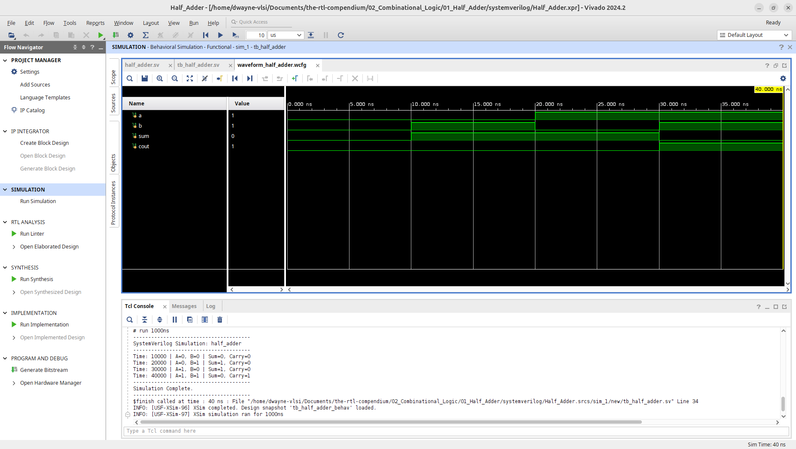

# Half Adder Arithmetic Circuit

This module implements a 1-bit Half Adder, the fundamental combinational logic building block for binary arithmetic across multiple HDLs. The design has been verified through RTL elaboration and behavioral simulation using **AMD Vivado 2024.2**.

## 1. Hardware Schematic (RTL Analysis)
The following schematic was generated using the **Vivado Elaborated Design** tool. It represents the logical mapping of the HDL code into generic hardware primitives.

**Note on Elaboration:** As seen in the diagram, Vivado synthesizes the arithmetic addition into two distinct logic gates: an `RTL_XOR` for the Sum and an `RTL_AND` for the Carry out. This demonstrates how complex mathematical operations are physically realized using basic logic primitives.

## 2. Logic Specification
The Half Adder computes the addition of two single-bit binary numbers ($A$ and $B$), producing a 1-bit $Sum$ and a 1-bit Carry out ($C_{out}$).

**Boolean Equations:** 
* $Sum = A \oplus B$
* $C_{out} = A \cdot B$

### Truth Table
| Input A | Input B | Sum | $C_{out}$ |
| :---: | :---: | :---: | :---: |
| 0 | 0 | 0 | 0 |
| 0 | 1 | 1 | 0 |
| 1 | 0 | 1 | 0 |
| 1 | 1 | 0 | 1 |

---

## 3. Implementation
This repository provides the implementation in three major Hardware Description Languages (HDLs). 

* **[Verilog Source](verilog/half_adder.v)**
* **[VHDL Source](vhdl/half_adder.vhd)**
* **[SystemVerilog Source](systemverilog/half_adder.sv)**

---

## 4. Verification & Simulation
To ensure logic correctness, testbenches were used to sweep through all input combinations ($2^2 = 4$). 
* **[Verilog Testbench](verilog/tb_half_adder.v)**
* **[VHDL Testbench](vhdl/tb_half_adder.vhd)**
* **[SystemVerilog Testbench](systemverilog/tb_half_adder.sv)**

### Behavioral Waveform & Tcl Console Output
The simulation waveforms confirm the logical behavior, specifically verifying that $C_{out}$ is only asserted high when both $A$ and $B$ are high.

**Verilog Waveform:**

**VHDL Waveform:**

**SystemVerilog Waveform:**

